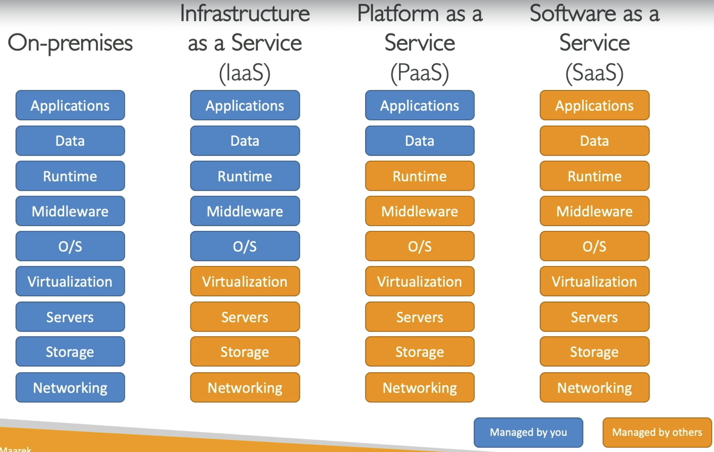
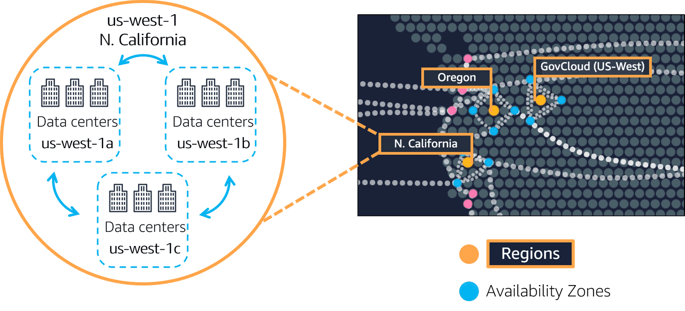
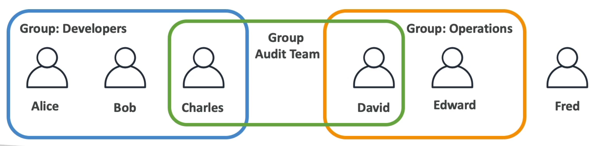

# AWS
This section covers the next topics:
- [Cloud](#cloud)
- [Availability zone](#availability-zone)
- [IAM](#availability-zone)
    - [IAM Policies](#policies)
    - [IAM Roles](#iam-roles)
    - [IAM Best practices](#best-practices)
- [EC2](#ec2)
    - [Configuration](#configuration)
    - [Instance Types](#instance-types)
    - [Security Groups](#security-groups)
    - [Purchasing options](#purchasing-options)
    - [EBS - Elastic Block Store](#ebs---elastic-block-store)
        - [Volume](#volume)
        - [Snapshot](#snapshot)
    - [AMI - Amazon Machine Image](#ami---amazon-machine-image)
    - [EC2 Instance Store](#ec2-instance-store)
    - [EFS - Elastic File System](#efs---elastic-file-system)
        - [EBS vs EFS](#ebs-vs-efs)
        - [EFS-IA - Infrequent Access](#efs-ia---infrequent-access)
    - [FSx - File Service](#fsx---file-service)
    - [Load Balancer](#load-balancer)
        - [Load Balancer Types](#load-balancer-types)
    - [Auto Scaling Group](#auto-scaling-group)
        - [Scaling Strategies](#scaling-strategies)
- [S3](#s3---simple-storage-service)
    - [Features](#features)
    - [Security](#security)
    - [Storage Classes](#storage-classes)
    - [Replication](#replication)
    - [Encryption](#s3-encryption)
    - [AWS Snow Family](#aws-snow-family)
- [Databases](#databases)
    - [RDS](#rds---relational-database-service)
        - [Deployments](#deployments)
    - [Aurora](#aurora)
        - [RDS vs Aurora](#rds-vs-aurora)
        - [Aurora Serverless](#amazon-aurora-serverless)
    - [ElastiCache](#elasticache)
    - [DynamoDB](#dynamodb)
        - [DymanoDB Accelerator](#dymanodb-accelerator---dax)
        - [Global tables](#global-tables)
    - [Redshift](#redshift)
        - [Redshift serverless](#redshift-serverless)
    - [EMR - Elastic MapReduce](#amazon-emr)
    - [Athena](#amazon-athena)
    - [QuickSight](#amazon-quicksight)
    - [DocumentDB](#amazon-documentdb)
    - [Neptune](#amazon-neptune)
    - [Timestream](#amazon-timestream)
    - [QLDB - Quantum Ledger Database](#amazon-qldb---quantum-ledger-database)
    - [Managed Blockchain](#amazon-managed-blockchain)
    - [Glue](#glue)
    - [DMS - Database Migration Service](#dms---database-migration-service)
- [ECS - Elastic Container Service](#ecs---elastic-container-service)
    - [Fargate](#fargate)
- [EKS - Elastik Kubernetes Service](#eks---elastik-kubernetes-service)
- [Lambda](#amazon-lambda)
- [API Gateway](#api-gateway)
- [Batch](#aws-batch)
- [Lightsail](#amazon-lightsail)
- [VPC](#) - todo
- in progress

## Cloud
Cloud computing is the on-demand delivery of compute power, database storage, application, and other IT resources.
Advantages:
1. Flexibility
2. Cost-effectiveness
3. Scalability
4. Elasticity
5. High-availability and fault-torelance
6. Agility

Types of cloud computing:
* IaaS - Infrastructure as a Service - EC2
* PaaS - Platform as a Service - Elastic Beanstalk
* SaaS - Software as a Service - Rekognition


Pricing:
* Compute - Lambda, EC2, ECS
* Storage - S3
* Data transfer out of the cloud

## Availability zone
Availability zone is one or more discrete data centers with redundant power, networking, and connectivity.
Each region has 3-6 availability zones.


## IAM
IAM - Identity and Access Management - global service.

Groups only contain users, not other groups. User can belong to multiple groups and could be not a part of any group.


Users or Groups can be assigned with policies.

### Policies
Consists of:
* Version - policy language version - "2012-10-17"
* (optional) Id - an identifier for the policy
* Statement - one or more individual statements
```
{
    "Version": "2012-10-17",
    "Id": "Some-ID",
    "Statement": [
        {
            "Sid": "FullAccess",  - identifier
            "Effect": "Allow",    - Allow, Deny
            "Action": ["s3:*"],   - list of actions (s3:GetObject)
            "Principal": {        - account/user/role to which the policy applied to
                ...
            }
            "Resource": ["*"]     - list of resources to which the action is applied ("arn:aws:s3:::mybucket/*")
        },
        {
            "Sid": "DenyCustomerBucket",
            "Action": ["s3:*"],
            "Effect": "Deny",
            "Resource": ["arn:aws:s3:::customer", "arn:aws:s3:::customer/*" ]
        }
    ]
}
```

### IAM Roles
Secure way to grant permissions to entities in AWS.
Unlike IAM users, roles are not tied to a specific individual or service; instead, they are assumed by trusted entities such as AWS services, applications, or users.

Roles provide temporary security credentials (access keys, secret keys, and session tokens) to perform tasks based on the defined permissions. They are widely used for scenarios like granting EC2 instances access to S3, cross-account access,
or enabling AWS Lambda functions to interact with other AWS resources securely.

### Best practices
* Don't use the root account
* One physical user - one AWS user
* Assign users to groups and assign permissions to groups
* Create a strong password policy
* Use and enforce the use of MFA
* Create and use Roles for giving permissions to AWS services
* Use Access Keys for Programmatic access
* Audit permissions of your account using IAM Credentials Report & IAM Access Advisor

## EC2 - Elastic Compute Cloud
Amazon Elastic Compute Cloud (EC2) is a web service that provides secure, resizable compute capacity in the cloud. EC2’s simple interface allows to obtain and configure capacity with minimal friction.

It provides you with complete control of your computing resources and lets you run on Amazon’s proven computing environment. Amazon EC2 reduces the time required to obtain and boot new server instances to minutes, allowing you to quickly scale capacity, both up and down, as your computing requirements change. Amazon EC2 provides developers the tools to build failure resilient applications and isolate them from common failure scenarios.

### Configuration
* Operating System: Linux, Windows, Mac OS
* CPU
* RAM
* Storage-space
* Network card
* Firewall rules
* Bootstrap script

### Instance types
How to read: `m5.2xlarge`
* `m` - instance class
* `5` - generation
* `2xlarge` - size within the instance class

Types:
* General Purpose Instances: Provide a balanced mix of compute, memory, and networking resources, suitable for a variety of workloads such as web servers and code repositories. Examples include the M7g and T4g families
* Compute Optimized Instances: Designed for compute-intensive applications that benefit from high-performance processors, ideal for tasks like batch processing and high-performance web servers. The C7g family is a representative example.
* Memory Optimized Instances: Offer high memory capacity for memory-intensive applications, such as databases and real-time big data analytics. The R7g family falls into this category.
* Storage Optimized Instances: Provide high, sequential read and write access to large datasets on local storage, suitable for data warehousing and distributed file systems. Examples include the I4i and D3 families.
* Accelerated Computing Instances: Utilize hardware accelerators, or co-processors, to perform functions like floating-point number calculations and graphics processing more efficiently than software running on CPUs. The P5 and G5 families are examples.
* High-Performance Computing Instances: Purpose-built to offer the best price performance for running HPC workloads at scale on AWS, ideal for large, complex simulations and deep learning workloads. The Hpc7g family is an example.

### Security Groups
Security groups control how traffic is allowed into or out of EC2. It is a virtual firewall.
They only contain `allow` rules.

Security groups riles can be reference by IP or by security group.


They are locked down to a region/VPC combination.

It's good to maintain one separate security group for SSH access.

Classic ports:
* 21 - FTP
* 22 - SSH, SFTP
* 80 - HTTP
* 443 - HTTPS
* 3389 - RDP

### Purchasing options
* On-demand instances - short workload, predictable pricing, pay by second
* Reserved (1 & 3 years)
    * reserved instances - long workloads
    * convertible reserved instances - long workloads with flexible instances
* Savings Plans (1 & 3 years) - commitment to an amount of usage, long workload
* Spot instances - short workloads, cheap, can lose instances (less reliable)
* Dedicated Hosts - book an entire physical server, control instance placement
* Dedicated Instances - no other customers will share your hardware
* Capacity Reservations - reserve capacity in a specific AZ for any duration


### EBS - Elastic Block Store
#### Volume
EBS Volume is a network drive (not a physical drive) you can attach to your EC2. It is bound to a specific AZ.

It can only be mounted to one instance at a time, except for io1 and io2 volume types (EBS Multi-Attach feature).

#### Snapshot
Snaphot is a copy of EBS volume at a point in time. Can copy shanpshots across AZ or Region.

Features:
* Archive - to save 75%, takes 24-72 hours for restoring the archive.
* Recycle Bin for EBS Snapshots (specify retention 1 day - 1 year)

### AMI - Amazon Machine Image
AMI is a customization of an EC2 instance. This also creates EBS snapshot behind the scenes.

### EC2 Instance Store
EBS volumes are network drives with limited performance. If we need a high-performance hardware disk, use EC2 Instance Store.

* Better I/O performance.
* EC2 Instance Store lose their storage if they are stopped.
* Good for buffer/cache/scratch data/temp content.

### EFS - Elastic File System
It's managed NFS (network file system) that can be mounted on 100s of EC2. It only works with Linux EC2 instances in multi AZ.

* Highly available
* Scalable
* Expensive (3x gp2)
* Pay per use
* No capacity planning

#### EBS vs EFS


#### EFS-IA - Infrequent Access
That's a storage class that is cost-optimized for files not accessed every day.

* Up to 92% lower cost compared to EFS Standard
* EFS will automatically move your files to EFS-IA based on the last time they were accessed and lifecycle policy.

### FSx - File Service
Manager service to launch 3rd party high-performance file system
* Amazon FSx for Windows File Server
* Amazon FSx for Lustre (Linux): 100s GB/s, millions of IOPs, sub-ms latencies 


### Load Balancer
Load Balancers are servers that forward internet traffic to multiple servers (EC2) downstream.


#### Load Balancer Types
1. Application Load Balancer (HTTP/HTTPS/gRPC) - Layer 7
2. Network Load Balancer (high performance, allows for TCP) - Layer 4
3. Gateway Load Balancer - Layer 3
4. Classic Load Balancer (retired 2023) - Layer 4 & 7


### Auto Scaling Group
* scale out - add EC2
* scale in - remove EC2
* automatically register new instances to a load balancer
* replace unhealty instances

#### Scaling Strategies
* Manual Scaling
* Dynamic Scaling
    * Simple / Step Scaling - Cloud watch alarm is triggered CPU > 70% - add 2 units
    * Target Tracking Scaling - the average ASG CPU should stay at arount 40%
    * Scheduled Scaling - known patterns usage
* Predictive Scaling - uses machine learning to predict future traffic ahead of time

## S3 - Simple Storage Service
Amazon S3 is an object storage service that stores data as objects within buckets.
An object is a file and any metadata that describes the file.
A bucket is a container for objects.

* Buckets must have a globally unique name (across all regions all accounts)
* Buckets are defined at the region level
* Max object size is 5TB

Bucket types:
1. General Purpose
2. Directory

### Features
* Allows to host static content/website.
* Versioning
    * enabled at the bucket level
    * same key overwrite will change the version
    * any file that is not versioned prior to enabling versioning will have version 'null'
    * suspending versioning does not delete the previous versions
    * deleting objects with version ID null will place a delete marker and the file could be restored

### Security
* User-based
    * IAM Policies - API calls
* Resource-based
    * Bucket Policies - bucket wide rules from the S3 console
    * Object Access Control List (ACL) - finer grain (can be disabled)
    * Bucket Access Control List (ACL) - less common (can be disabled)
* Encryption - using encryption keys

### Storage Classes
* Standard: General-purpose storage for frequently accessed data.
* Intelligent-Tiering: Automatically moves data between two access tiers when access patterns change.
* Standard-IA (Infrequent Access): For data that is accessed less frequently but requires rapid access when needed.
* One Zone-IA: Lower-cost option for infrequently accessed data that does not require multiple Availability Zone resilience.
* Glacier: Low-cost storage for data archiving with retrieval times ranging from minutes to hours.
* Glacier Deep Archive: Lowest-cost storage for long-term data archiving with retrieval times of 12 hours or more.

### Replication
* CRR - Cross region replication - compliance, lower latency access, replication across accounts
* SRR - Same region replication - log aggregation, live replication between prod and test

Features:
* Must enable versioning in source and destination buckets
* buckets can be in different AWS accounts
* Replication happens asynchronously

### S3 Encryption
* Server-Side Entryption (default)
* Client-Side Encryption

### AWS Snow Family
Offline devices to perform data migrations. 

#### Flow
1. Request Snowball devices from the AWS console for delivery
2. Install the snowball client / AWS OpsHub on your servers
3. Connect the device to the server and copy files using the client
4. Ship back the device
5. Data will be loaded into S3
6. Snowball is completely wiped

## Databases
### RDS - Relational Database Service
It's managed DB service for SQL DBs. Examples are: Postgres, MySQL, MariaDB, Oracle, Microsoft SQL Server, IBM DB2, Aurora (AWS proprietary database).

You cannot SSH into the instance

#### Creation
Templates:
* Production
* Dev/Test
* Free tier

#### Deployments
* Read Replicas
    * Scale the read workload with up to 15 Read Replicas
    * Data is only written to the main DB
    

* Multi-AZ
    * Failover in case of AZ outage
    * Data is only read/written to the main database
    * only one failover AZ


* Multi-Region
    * Disaster recovery
    * Local performance for global reads


### Aurora
Aurora is proprietary technology from AWS (not open sources). It's cloud optimized and claims 5x performance improvement over MySQL on RDS, over 3x performance of Postgres on RDS

Its storage automatically grows in increments of 10GB, up to 128 TB.

#### RDS vs Aurora
RDS is an overlay technology based on existing databases such as Oracle, MySQL, and Microsoft SQL Server, while Aurora is a separate option that has been built from the ground up by AWS. 

RDS provides a quick-and-easy setup process with preconfigured parameter settings, while Aurora requires more work upfront to customize data storage.

In terms of infrastructure, RDS runs on dedicated hardware clusters in AWS’s data centres with certain hardware limitations, while Aurora has virtually unlimited compute and storage scaling capabilities. That said, RDS can be moved easily between regions or Availability Zones within a region without configuration changes, whereas for Aurora, there are associated risks involved with live data transfers. 

#### Amazon Aurora Serverless
Automated database instantiation and auto-scaling based on actual usage.

### ElastiCache
The same way RDS is to get managed Relational Databases it works for Redis or Memcached.

### DynamoDB
Fully managed highly available db with replication across 3 AZ. It's NoSQL - key/value. It's "serverless" database.

Handles:
* Millions of RPS
* Trillions of row
* 100s of TB of storage
* Single-digit millisecond latency

#### DymanoDB Accelerator - DAX
Fully managed in-memory cache for DynamoDB. 10x performance improvement.

#### Global tables
It allows to create DynamoDB table accessible with low latency in multiple regions with 2-way replication. You can acrively read and write to DB in any region.

### Redshift
Based on Postgres. It's OLAP (Online analytical processing) - analytics and data warehousing

Features:
* 10x better performance than other data warehouses
* scale to PBs of data
* load data once an hour
* columnar storage of data
* Massively Parallel Query Execution (MPP)
* BI tools (Tableau) is integrated
* SQL interface for queries

#### Redshift serverless
...

### Amazon EMR
Elastic MapReduce - helps creating Hadoop clusters to analyze and process vast amount of data.

### Amazon Athena
Serverless query service to perform analytics against S3 objects. Uses SQL to query the files.

Supports CSV, JSON, ORC, Avro, Parquet.

### Amazon QuickSight
Serverless machine learning-powered business intelligence service to create interactive dashboards.

Integrated with RDS, Aurora, Athena, Redshift, S3...

### Amazon DocumentDB
Aurora version of MongoDB.

### Amazon Neptune
Fully managed graph database.

Features:
* Highly available across 3 AZ, up 15 read replicas

### Amazon Timestream
Fully managed serverless time series DB.

### Amazon QLDB - Quantum Ledger Database
A ledger is a book recording financial transactions. Fully managed, serverless, replication across 3 AZ.

Used to review history of all the changes made to application data over time. It is immutable - no entry can be removed or modified, cryptographically verifiable. There is no decentralization component.

Manipulate with data using SQL.

### Amazon Managed Blockchain
It is a managed service to join public blockchain networks or create your own scalable private network.

Compatible with Hyperledger Fabric and Ethereum.

### Glue
Managed extract, transform and load (ETL) service. Useful to prepare and transform data for analytics. Fully serverless.


### DMS - Database Migration Service

## ECS - Elastic Container Service
Run Docker containers on EC2.
Amazon ECS is a fully managed container orchestration service that makes it easy to deploy, manage, and scale containerized applications using Docker. It supports both Docker and AWS Fargate, allowing you to run containers without needing to manage the underlying infrastructure.

## Amazon ECR - Elastic Container Registry
Amazon private analogue of docker hub. For more information about docker see [link](/general/README.md#docker)

### Fargate
Run Docker containers without provisioning the infrastructure.
AWS Fargate is a serverless compute engine for containers that works with both Amazon ECS and Amazon EKS (Elastic Kubernetes Service). With Fargate, you don't need to provision or manage servers; you simply specify the resources required for your containers, and Fargate handles the rest.

## EKS - Elastik Kubernetes Service
Allows to launch managed Kubernetes clusters on AWS. Containers can be hosted on:
1. EC2 instances
2. Fargate (Serverless)

## Amazon Lambda
AWS Lambda is a serverless compute service that lets you run code without provisioning or managing servers. 

Price is based on calls and duration (GB (RAM)/ sec)

## API Gateway
Fully managed service to create, publish, maintain and monitor APIs.


## AWS Batch
Fully managed batch processing at any scale. Efficiently run 100,000s of computing batch jobs on AWS. It will dynamically launch EC2 istances or Spot Instances.

## Amazon Lightsail
Amazon Lightsail is a simplified cloud platform designed for those who need a straightforward way to launch and manage virtual private servers.